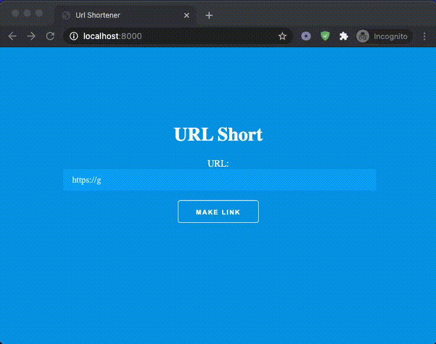

# URL Short

## Description

A URL Shortener built with Django



## Features

* Shortens URL's to a path of 6 characters

* Admin panel for url management


## Environment Setup

```
python -m venv venv

source venv/bin/activate

vim .env (Export SECRET_KEY as env variable)

set -a; source .env; set +a
```

## Install & Deploy Django

```
python -m pip install Django

python manage.py makemigrations

python manage.py migrate

python manage.py runserver
```

## Run Tests

```
python manage.py test shortener
```
